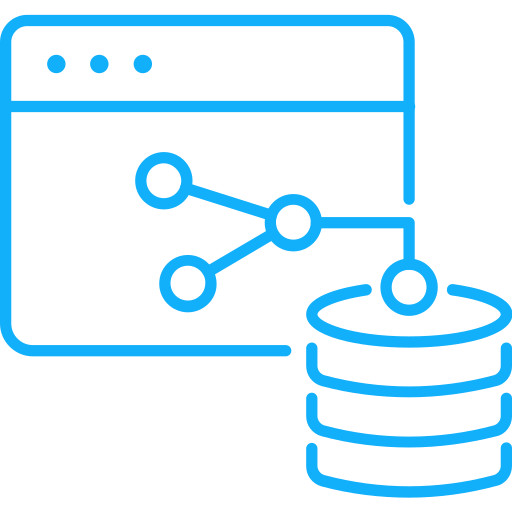

# DDI GraphQL LifeCycle POC

<div style="text-align: center;">
    
    <div style="color: #fff; padding: 1em; font-size: .75em;">
    <span>
        <span style="background-color: #900; padding: .4em .6em; border-radius: .5em 0 0 .5em;">DDI</span><span style="background-color: #666; padding: .4em .6em; border-radius: 0 .5em .5em 0;">Hackathon</span>
    </span>
    <span>
        <span style="background-color: #009; padding: .4em .6em; border-radius: .5em 0 0 .5em;">Gothenburg</span><span style="background-color: #666; padding: .4em .6em; border-radius: 0 .5em .5em 0;">2023</span>
    </span>
    </div>
</div>

## Install
Install NPM Packages
```
npm i
```
Run dev server or live server
```
npm run dev
```
```
npm run start
```

## Configuration
The ```API.Query()``` function can be used in a similar way GraphQL Query is built.

## Limitations
This POC is hard coded and works only with the attached sample file from [ddialliance.org](https://ddialliance.org/learn/markup-examples-by-version?field_ddi_product_tid=464)

## Source
This POC was created as part of the [DDI Hackathon 2023 in Gothenburg](https://github.com/ddi-hackathon-2023)